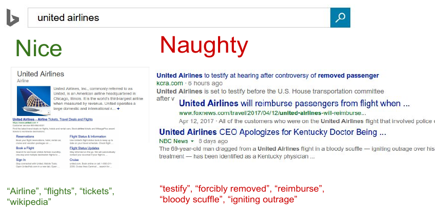
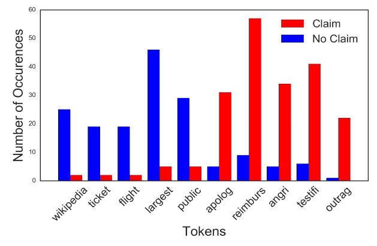
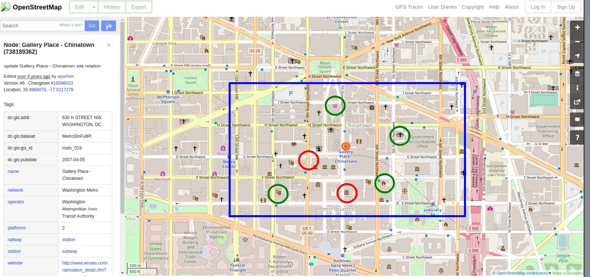

 
<b>Predictive modeling technology for the commercial insurance industry.</b> 

Tyche builds predictive models for the insurance industry. We maintain those models and deliver inferences on-demand via web API. This repository contains code that is used to build those models, along with documentation describing the relevant data sources and modeling techniques. 

**Note:** Due to the proprietary nature of the models developed with insurer's data, this repository does not include any proprietary data, intermediary files, or parameter tunings. Because of this, most of this code is not directly applicable outside of Tyche's data analytics environment. 

## Documentation
Contains white papers and presentations on:
 * Webgression - white paper
 * Webgression - slides
 * Streetscope - short presentation
 * Firm-level intelligence - White paper - Using Bayesian statistics, NLP, and 3rd party data to infer properties of individual insured firms. 

## Source Code

### Webgression
Automatically search Bing and build a naive-Bayes classifier of insurance risk based on text extracted from web search results. 

### Streetscope
Calculate the risk of an applicant's address, based on geographic proximity to *amenities* as found in the [Open Street Map](https://www.openstreetmap.org/) database, such as *place of worship*, *tattoo shop*, or *school*. This is a way to calculate "good and bad neighborhoods" of insurance risk at the street-level, rather than relying on ZIP code or other less granular and more hierarchical data sources. 

### Data Science support code

Tyche uses these data science support modules while exploring data and training models. 

**Warning:** This code is intended for exploratory use within Tyche's analytics environment. This is not product code, and provided only in case it might be helpful. 

#### Multiple Correspondence Analysis
A support library for performing Multiple Correspondence Analysis (MCA). MCA is a technique used to render high dimensional categorical data in a lower-dimensional Euclidean space.

#### Wildcat
A support library for handling categorical variables.

#### Zicata
A support library for engineering features based on ZIP code data.